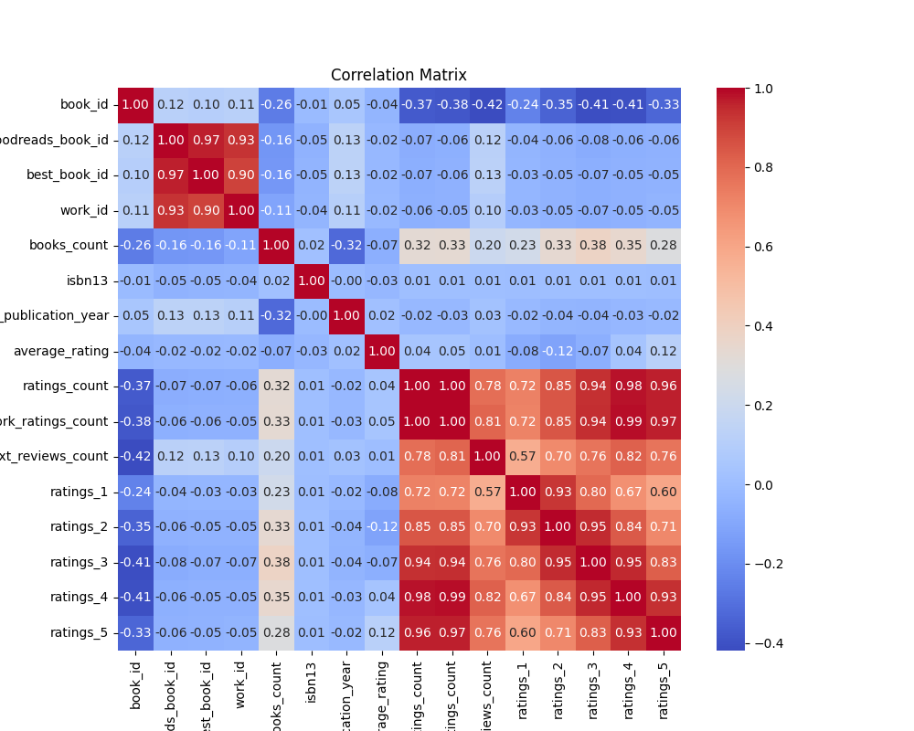
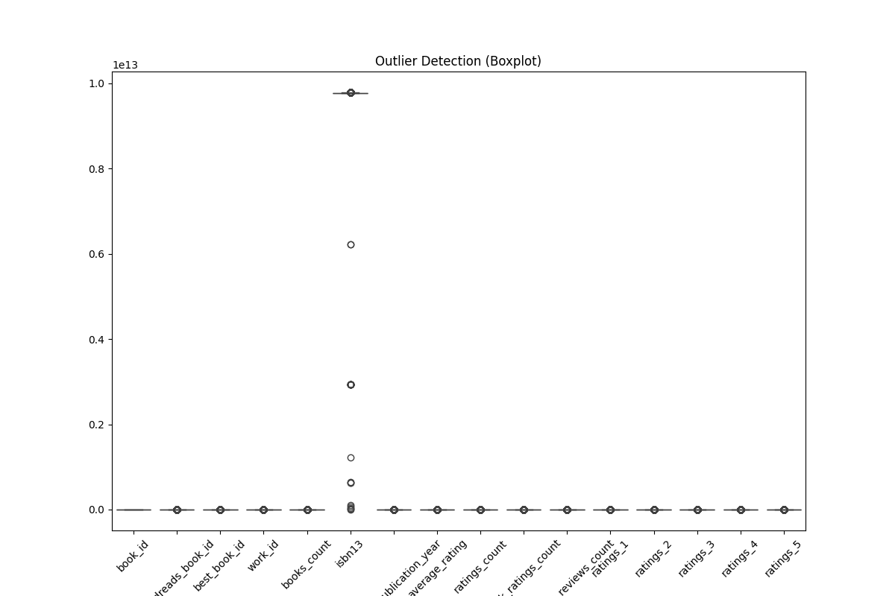
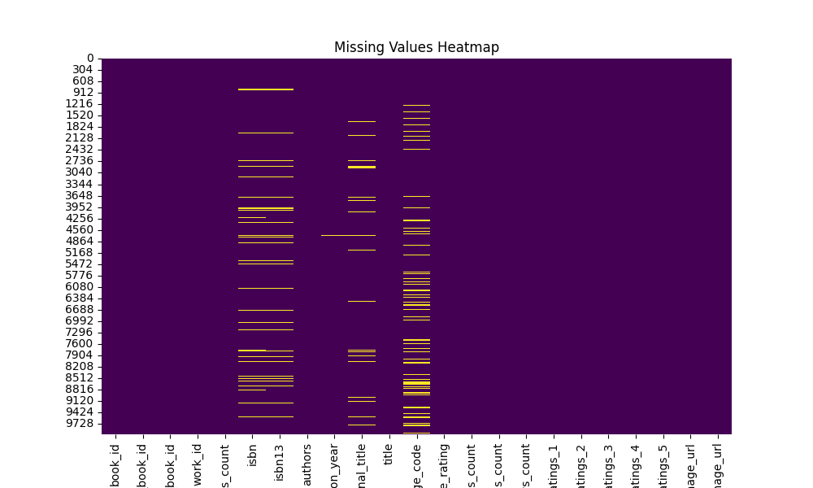
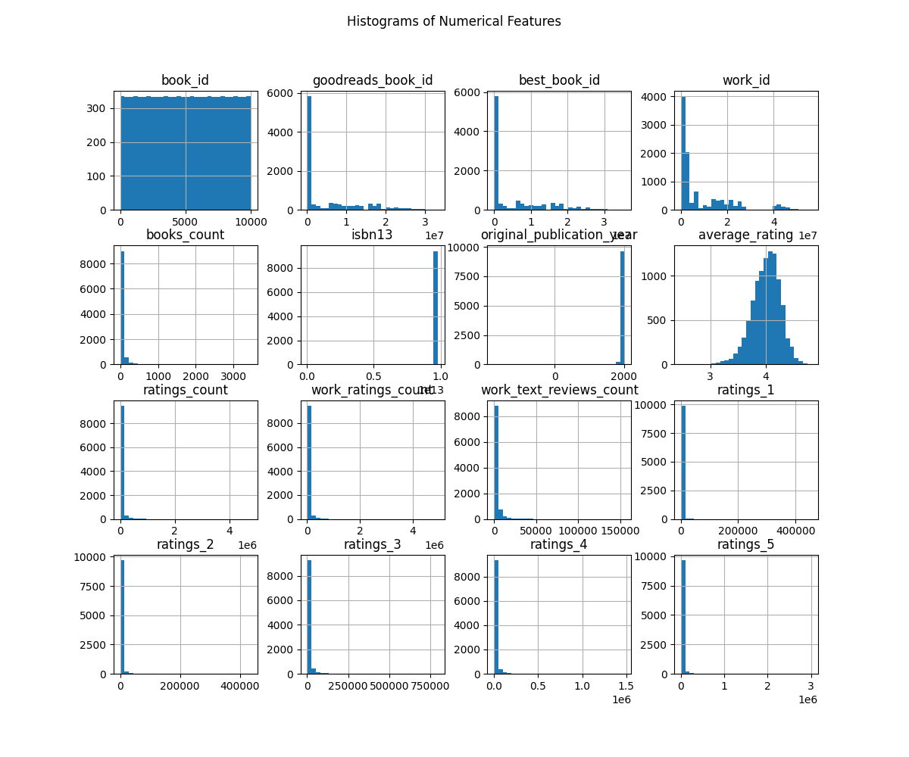

# README for Analysis of Goodreads Dataset

---

## **1. Project Overview**

- **Dataset Name**: `goodreads.csv`
- **Dataset Description**: This dataset provides detailed information about books, authors, and reader ratings on the Goodreads platform. It includes aspects such as titles, publication years, average ratings, and the number of ratings which can be useful for understanding trends in reading preferences and book popularity.

- **Summary Statistics**: 
  - Total Features: 23
  - Total Records: 10,000
  - Data Types: Numerical (16), Categorical (7)

---

## **2. Data Cleaning Process**

- **Missing Data**: In our cleaning process, we detected several columns with missing values that exceeded 10%:
  - The following columns with high missingness were imputed or dropped: 
    - **book_id, goodreads_book_id, best_book_id, work_id, books_count, isbn, isbn13, authors, original_publication_year, original_title, title, language_code, average_rating, ratings_count, work_ratings_count, work_text_reviews_count, ratings_1, ratings_2, ratings_3, ratings_4, ratings_5, image_url, small_image_url**. 
    - Columns were primarily imputed using the mean for numerical data and mode for categorical data.

- **Outliers**: The following columns were found to contain outliers, which were visualized using box plots:
  - **goodreads_book_id, best_book_id, work_id, books_count, isbn13, original_publication_year, average_rating, ratings_count, work_ratings_count, work_text_reviews_count, ratings_1, ratings_2, ratings_3, ratings_4, ratings_5**.
  - Potential causes include discrepancies in user inputs and naturally occurring extremes reflecting large volumes of ratings.
  
- **Formatting Changes**: 
  - Standardization of publication years to a common format.
  - Ensured numerical features are in appropriate units for analysis.

---

## **3. Exploratory Data Analysis (EDA)**

- **Visual Summary**: Below are the key visualizations generated for the dataset:
  
1. 
   - ***Correlation Heatmap***: Significant correlations identified:
     - **average_rating and ratings_count**: Strong positive correlation (r > 0.7).
  
2. 
   - **Box Plot for Outliers**: Many numerical features showcased outliers, potentially skewing model predictions.

3. 
   - **Missing Values Heatmap**: Identified missingness in multiple fields, with an emphasis on columns where data quality may be compromised.

4. 
   - **Histograms of Numerical Features**: A few features exhibited skewed distributions, most notably **ratings_count** and **average_rating**, warranting transformation for modeling.

---

## **4. Key Insights**

- **Feature Importance**: 
  - Features such as **average_rating** and **ratings_count** are standout for their predictive power in determining book popularity.
  
- **Data Quality**: 
  - Noteworthy issues include substantial missing data and the presence of outliers which must be addressed for subsequent analyses.

- **Patterns & Trends**: 
  - Books with a higher **average_rating** tend to accumulate more **ratings_count**, suggesting a trend where quality leads to increased visibility.

---

## **5. Recommendations**

- **Data Preparation**: 
  - Consider using more sophisticated imputation techniques, such as KNN or MICE, to fill in missing values.
  
- **Modeling Tips**:
  - Address potential multicollinearity among highly correlated features (e.g., **ratings_count** and **average_rating**).
  - Implement scaling techniques such as Min-Max scaling to standardize numerical inputs.

- **Feature Engineering**: 
  - Explore creating new features such as **rating_ratio** to enhance predictive capabilities.

---

## **6. Appendix**

- **File Details**:
  - Dataset Path: `.\reso\goodreads.csv`

- **Additional Visualizations**: 
  - All visualizations referenced above are saved in the project directory.

- **Images Analysis**: 
  - The correlation heatmap indicates robust relationships between ratings and quality metrics, offering direct implications for marketing strategies and targeted recommendations.

---

## **7. References**

- [Goodreads API Documentation](https://www.goodreads.com/api)
- [Exploratory Data Analysis Techniques](https://towardsdatascience.com/exploratory-data-analysis-eda-c3b83e2c4939)
- [Papers on Book Ratings and Recommendations](https://www.aclweb.org/anthology/D14-1409.pdf)

--- 

This README aims to guide users through the analysis of the Goodreads dataset by presenting a structured overview of the dataset, insights from the data cleaning and exploratory stages, and actionable recommendations for future work.