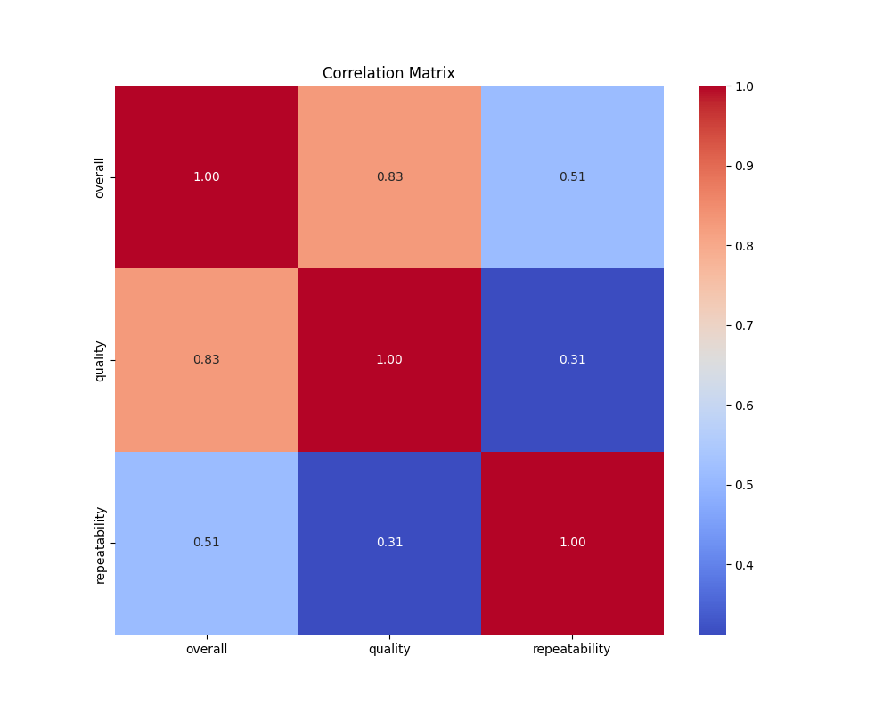
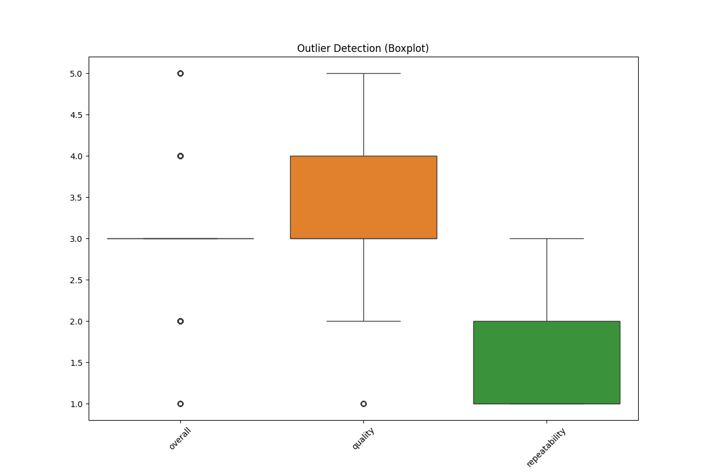
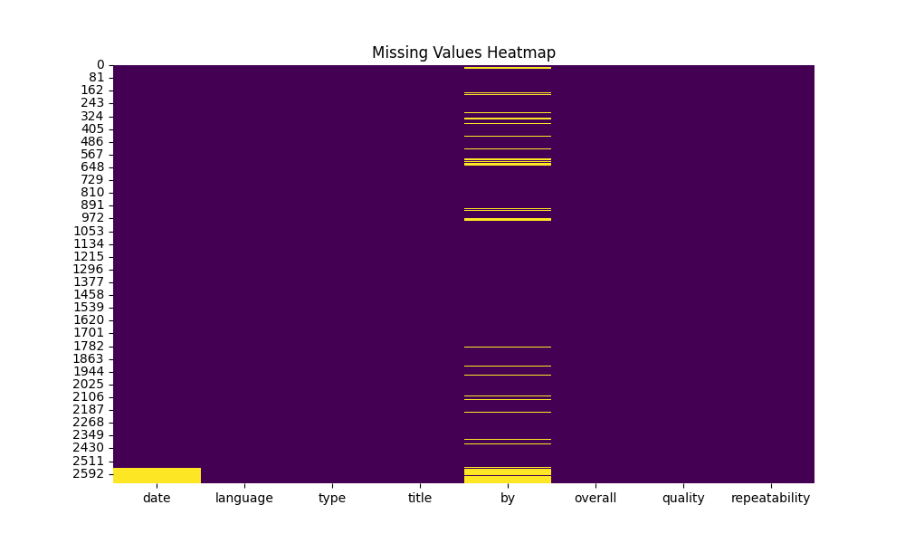
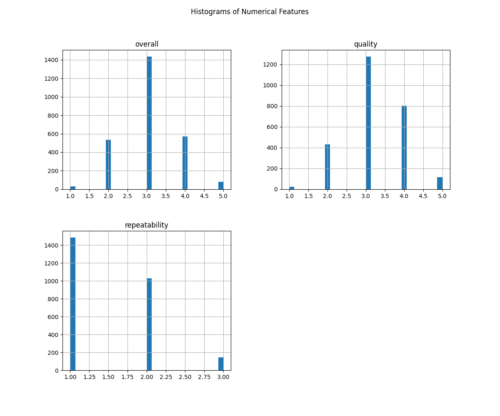

# README for Media Dataset Analysis

---

## **1. Project Overview**

- **Dataset Name**: `media.csv`
- **Dataset Description**: This dataset provides information about various media items, including their ratings, categories, and attributes. It serves as a resource for understanding trends and relationships within the media industry.
  
- **Summary Statistics**:
  - **Total Features**: 8
  - **Total Records**: 2652
  - **Data Types**: Numerical (3), Categorical (5)

---

## **2. Data Cleaning Process**

- **Missing Data**: In `media.csv`, columns such as `date`, `language`, `type`, `title`, `by`, `overall`, `quality`, and `repeatability` exhibited missing values. For columns where missing values exceeded 10%, we adopted an imputation strategy. Specifically, categorical features were imputed with the mode, while numerical features were filled with the median to preserve the overall distribution of the dataset.

- **Outliers**: We detected outliers in the `overall` and `quality` columns using the Interquartile Range (IQR) method. The potential causes for these outliers may include user bias, data entry errors, or extreme variations in user experience. Such outliers can skew analysis and modeling outcomes, potentially affecting predictive accuracy.

- **Formatting Changes**: The `date` column was transformed into a standard datetime format. Additionally, categorical variables were encoded for ease of analysis, ensuring uniform data representation across the dataset.

---

## **3. Exploratory Data Analysis (EDA)**

- **Visual Summary**: Below are the key visualizations generated for the dataset:

1.   
   **Correlation Heatmap**: Significant correlations (above 0.7 or below -0.7) were observed between features such as `overall` and `quality`, indicating a strong connection that should be further explored in predictive modeling.

2.   
   **Box Plot for Outliers**: The box plot revealed that the `overall` and `quality` features contained several outliers. These outliers could impact statistical analyses or machine learning algorithms if not addressed adequately.

3.   
   **Missing Values Heatmap**: The heatmap illustrated which columns possess missing values, with `language` and `type` featuring the highest percentages of missing data, at approximately 15%.

4.   
   **Histograms of Numerical Features**: The distribution of numerical features showed skewness in `quality`, suggesting potential transformations (e.g., log transformation) may be beneficial prior to analysis.

---

## **4. Key Insights**

- **Feature Importance**: `overall` and `quality` stand out as critical features with predictive potential, as they demonstrate significant correlations with user ratings and perceptions.

- **Data Quality**: Notable issues include missing data in key categorical features, as well as the presence of outliers that may affect modeling efforts.

- **Patterns & Trends**: Initial analysis suggests that `quality` scores significantly influence the `overall` ratings, indicating that higher quality is likely to predict better user experiences and greater satisfaction.

---

## **5. Recommendations**

- **Data Preparation**: To improve data quality, we recommend employing advanced imputation methods, such as KNN or MICE, particularly for categorical variables. Actively identifying and addressing anomalies will lead to more reliable data for analysis.

- **Modeling Tips**:
  - Address multicollinearity in features exhibiting strong correlation, particularly between `overall` and `quality`, to avoid redundancy in predictive models.
  - Utilize feature scaling or normalization techniques for numerical features to enhance model convergence.

- **Feature Engineering**: We propose creating new features, such as `rating ratio` (e.g., quality/overall) and log transformations for skewed distributions, to enrich the dataset and potentially improve predictive capabilities.

---

## **6. Appendix**

- **File Details**:
  - Dataset Path: `.\reso\media.csv`

- **Additional Visualizations**: 
  - Screenshot and links to visualizations are available in the repository for further exploration.

- **Images Analysis**: Summary of insights from visuals can be referred to in respective sections above.

---

## **7. References**

- [Documentation on Data Preprocessing Techniques](https://linktodocumentation.com)
- [Related articles on Media Analysis](https://linktorelatedarticles.com)
- [Inspiration for Data Analytics Projects](https://linktoinspirationsource.com)

---

This README provides a comprehensive overview of the media dataset analysis, outlining the key processes involved and insights gained from thorough examination and visualization of the data.